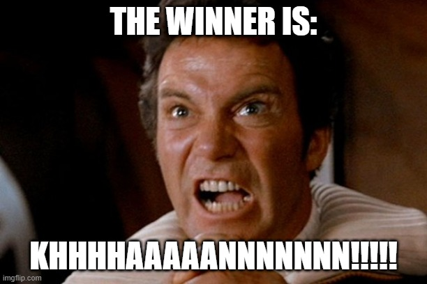

# python-challenge

### PyBank Submission
I wrote out a function that takes 2 parameters: a list of rows from the .csv file excluding the header and the length of list. It runs the calculations and returns a list of print statements to the main sub. The sub then iterates through the return list and writes/prints each statement to the terminal and the Analyst_Report.txt file.

I ended the script with a snippet of code that removes the last empty line from the output file. The source in the comments and at the end of this readme. My OCD has been appeased and all is well.

The run-time for the script is negligible.

- NOTE:

- PyBank Analysis-Report:
[Analysis-Report](PyBank/analysis/analysis_report.txt)

### PyPoll Submission
I wrote 2 functions for this part of the assignment:

The first takes a list of rows from the .csv file and the length of the list and then dynamically creates a ballot results template. The template is stored in a list with a column for unique candidate names, a column for votes initialized to 0 and a column to mark the winner during calculations. The function returns the ballot results template list.

The second function takes the list of rows from the .csv file and the length of the list and then passes those into the first function to generate the template. The function then runs all calculations and updates the number of votes for each candidate in the template and then marks the winner. The ballot results list is then passed to the main sub.

The rest of the code iterates through the ballot results template and writes/prints the final statements. The print/write code does iterate through the ballot results list to dynamically list the candidates.

I included the same clean-up snippet of code from PyBank which is sourced in the comments as well as at the end of this readme.

The average runtime for this script is around 5 seconds due to the dynamically created candidate list.

- PyPoll Analysis-Report:
[Analysis-Report](PyPoll/analysis/analysis_report.txt)

### References:
- Clean-up code to remove last blank line from txt files:
https://stackoverflow.com/questions/53086588/delete-last-and-blank-line-from-file-written-by-csv-writer

- Star Trek Image:
https://imgflip.com/memegenerator/100708178/Captain-Kirk-Khan